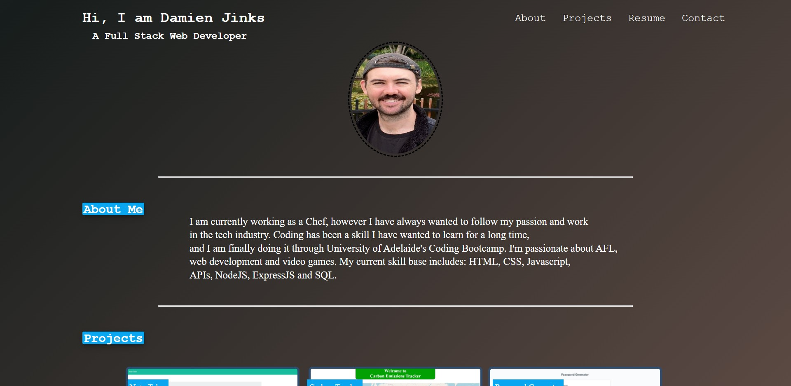

# Portfolio

### Live URL: https://djinksy.github.io/Portfolio-v2/

# Description
I have created this Portfolio as a way for potential employers to view my skills as a Web Developer. I have applied my knowledge of HTML and CSS to create a user friendly design containing a quick summary about me, links to my previous work, and links to get in touch with me.

To create this website, I used HTML and CSS syntax to format a modern looking Portfolio which adapts to all screen sizes.

By creating this Portfolio with the elements listed, I was able to gain a further understanding for how HTML and CSS work together to create the foundation for a webpage.

Within the images of the HTML I have added alt tags to every image for accessbility requirements.

# Credits

Damien Jinks

# Questions 

For any questions and comments please reach out to me through email at:
- damienjinks39@gmail.com

# Links
To view other projects visit:
- [Damien](http://github.com/Djinksy)
